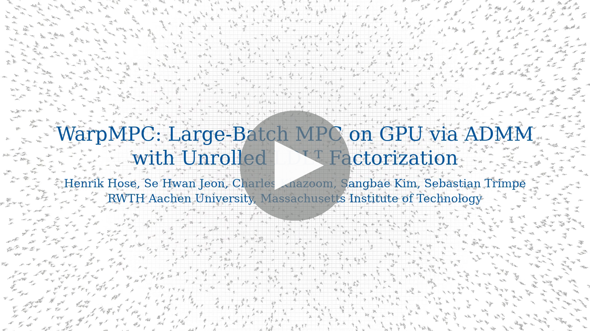

<!--  -->
<!-- <p align="center">
 
</p> -->

# WarpMPC

WarpMPC is a JAX library for fixed-pattern batched sparse MPC via SQP, line search, and OSQP-style ADMM for QP subproblems.
WarpMPC unrolls the sparse factorization and backsolves in the QP solve into custom Warp kernels.
WarpMPC further provides convenience tools for synthesizing large datasets from MPC in simulation and training neural network approximations that can be deployed on microcontroller hardware.

## Paper

A detailed description of the solver is available in the paper: [WarpMPC: Large-Batch MPC on GPU via ADMM with Unrolled LDLᵀ Factorization](https://arxiv.org/abs/2607.11603)

If you find WarpMPC useful, consider citing it:
```bibtex
@article{hose2026warpmpc,
  title={{WarpMPC}: Large-Batch {MPC} on {GPU} via {ADMM} with Unrolled {$LDL^\top$} Factorization},
  author={Hose, Henrik and Jeon, Se Hwan and Khazoom, Charles and Kim, Sangbae and Trimpe, Sebstian},
  journal={arXiv preprint arxiv:2607.11603},
  year={2026}
}
```

## Video

[](https://youtu.be/PW0e2TkDLyM)

## Modules

- `warpmpc.jax_sqp`: sparse MPC SQP assembly around CasADi stage functions.
- `warpmpc.numpysadi`: CasADi SX-to-JAX source conversion utilities.
- `warpmpc.jax_osqp`: fixed-pattern batched OSQP iterations built on QDLDL.
- `warpmpc.jax_qdldl`: batched fixed-pattern QDLDL factorization and solves.
- `warpmpc.jax_ampc`: dataset, training, checkpoint, rollout, and C export
  helpers for approximate MPC policies.

## Install

```bash
python -m pip install -e .
```

The default install contains the core library and example dependencies.
For the benchmarks, see `benchmarks/README.md`.

The library has been tested with Python `3.13` and `3.14`, CUDA `12.6` and `13.3`, JAX `0.10.0`.

## Minimal Use

```python
import numpy as np

from warpmpc.jax_osqp import OSQPSettings
from warpmpc.jax_sqp import build_sparse_mpc_plan, compile_sparse_mpc_sqp

# Build a SparseMPCProblem from CasADi stage functions, then compile one fixed
# sparsity pattern for batched solves.
settings = OSQPSettings(max_iter=25, scaling=10, warm_starting=True)
plan = build_sparse_mpc_plan(problem, osqp_settings=settings)
solver = compile_sparse_mpc_sqp(
    problem,
    plan,
    dtype=np.float32,
    osqp_settings=settings,
    qdldl_backend="warp",
    transpose_work=True,
    segmented=True,
    level_scheduled_solve=True,
)
```

Minimal  runnable examples that will run on laptop-grade hardware are in [examples/](./examples/), especially
[examples/jax_sqp_minimal.py](./examples/jax_sqp_minimal.py), [examples/jax_sqp_stagewise_minimal.py](./examples/jax_sqp_stagewise_minimal.py), and
[examples/jax_ampc_minimal.py](./examples/jax_ampc_minimal.py).
If your platform does not have CUDA or GPU support, you can run the examples with a jax backend by setting the `--qdldl-backend="jax"` flag.

There are also more involved examples [quadrotor AMPC synthesis](./examples/crazyflie_ampc/), [cartpole cost function tuning](./examples/cartpole_tuning/), and [humanoid whole-body MPC](./examples/humanoid/) that will require larger desktop or server GPUs.

## Examples and Benchmarks from the Paper

You can use the following entrypoints for these examples and for running the benchmarks from the paper.
The Slurm scripts can also be called directly with `bash`; in that mode the
`#SBATCH` lines are treated as comments.
```bash
# If you installed dependencies into a virtual environement
export VENV=/path/to/venv

# Big H100 examples, native execution
bash examples/crazyflie_ampc/run_h100_ampc_one_iteration.sh
bash examples/cartpole_tuning/run_h100_cartpole_physical_quadratic_tuning.sh

# Humanoid whole-body MPC, native Python execution
"${VENV}/bin/python" examples/humanoid/run_headless_batch.py --output results/humanoid/headless_humanoid_10k.npz

# Big H100 examples, Slurm execution
sbatch --account=<your-slurm-account> examples/crazyflie_ampc/run_h100_ampc_one_iteration.sh
sbatch --account=<your-slurm-account> examples/cartpole_tuning/run_h100_cartpole_physical_quadratic_tuning.sh

# Paper benchmark sweep, submits multiple Slurm jobs
SBATCH_ACCOUNT=<your-slurm-account> bash benchmarks/run_all_paper_benchmarks_h100.sh

# Paper benchmark sweep, native sequential execution (will take over 1 day)
bash benchmarks/run_all_paper_benchmarks_h100_sequential.sh
```

The `export VENV=/path/to/venv` setting is optional for the shell entrypoints; omit it
when the desired Python environment is already active.
For the direct humanoid Python command, either activate the environment first or call its Python binary as shown.
Note on the benchmarks: The PCG baseline is not yet merged into this codebase.

## Tests

```bash
python -m pytest
```

Some benchmark tests or smoke runs require optional GPU/backend dependencies.


## Related Repos and Acknowledgements
WarpMPC has been made possible thanks to many open-source projects.
Please also consider citing these:

- [**OSQP**](https://github.com/osqp/OSQP): The operator splitting QP solver
- [**QDLDL**](https://github.com/osqp/qdldl): A free LDL factorisation routine for quasi-definite linear systems.
- [**CasADi**](https://web.casadi.org/): A symbolic framework for numeric optimization implementing automatic differentiation
- [**JAX**](https://jax.readthedocs.io.): Composable transformations of Python+NumPy programs.
- [**Warp**](https://github.com/nvidia/warp): A Python framework for GPU-accelerated simulation, robotics, and machine learning.
